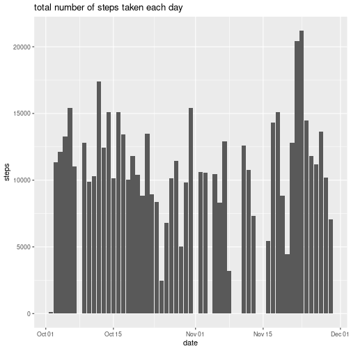
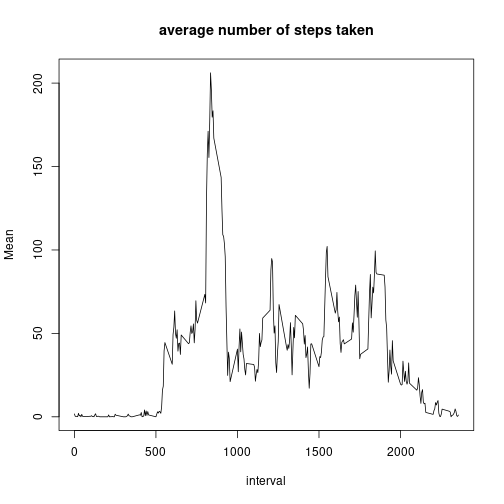
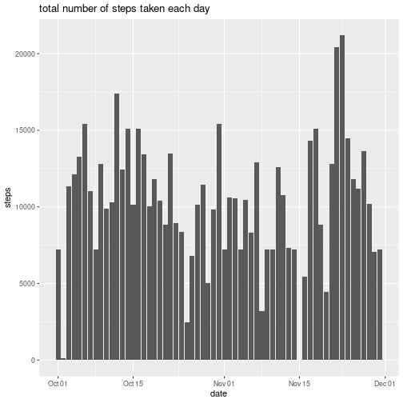
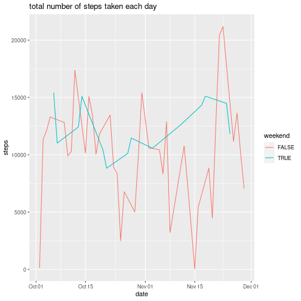

## Reproducible Research

This document shows an example of Reproducible Research with associated documentation

## 1 Code for reading in the dataset and/or processing the data


```r
library(readr)
library(dplyr)
library(ggplot2)

activity <- read_csv("Reproducible Research/week2/activity.csv")
```

## 2 Histogram of the total number of steps taken each day


```r
p <- ggplot(activity, aes(date))
p + stat_summary(aes(y = steps), fun = "sum", geom="bar") + labs(title = "total number of steps taken each day")
```



## 3 Mean and median number of steps taken each day


```r
m <- activity %>%
    group_by(date) %>%
        dplyr::summarize(Sum = sum(steps, na.rm=TRUE))
```

Mean:

```r
mean(m[["Sum"]])
```

```
## [1] 9354.23
```

Median:

```r
median(m[["Sum"]])
```

```
## [1] 10395
```

## 4 Time series plot of the average number of steps taken


```r
m <- activity %>%
    group_by(interval) %>%
        dplyr::summarize(Mean = mean(steps, na.rm=TRUE))
with(m, plot(interval, Mean, type = "l", main="average number of steps taken"))
```



## 5 The 5-minute interval that, on average, contains the maximum number of steps

The maximum 5-minute interval:

```r
m[m["Mean"] == max(m[["Mean"]]),][["interval"]]
```

```
## [1] 835
```

## 6 Code to describe and show a strategy for imputing missing data

Number of missing values

```r
library(data.table)

missingValues <- is.na(activity["steps"])
sum(missingValues)
```

```
## [1] 2304
```

Imputing missing data 

```r
impActivity <- copy(activity)
impActivity[missingValues,"steps"] <- 25
```

## 7 Histogram of the total number of steps taken each day after missing values are imputed


```r
p <- ggplot(impActivity, aes(date))
p + stat_summary(aes(y = steps), fun = "sum", geom="bar") + labs(title = "total number of steps taken each day")
```



Compute mean and median

```r
m <- impActivity %>%
    group_by(date) %>%
        dplyr::summarize(Sum = sum(steps, na.rm=TRUE))
mean(m[["Sum"]])
```

```
## [1] 10298.49
```

```r
median(m[["Sum"]])
```

```
## [1] 10395
```

## 8 Panel plot comparing the average number of steps taken per 5-minute interval across weekdays and weekends


```r
activity <- mutate (activity, weekend = weekdays(date) == "Saturday" | weekdays(date) == "Sunday")

p <- ggplot(activity, aes(date, color=weekend))
p + stat_summary(aes(y = steps), fun = "sum", geom="line") + labs(title = "total number of steps taken each day")
```


